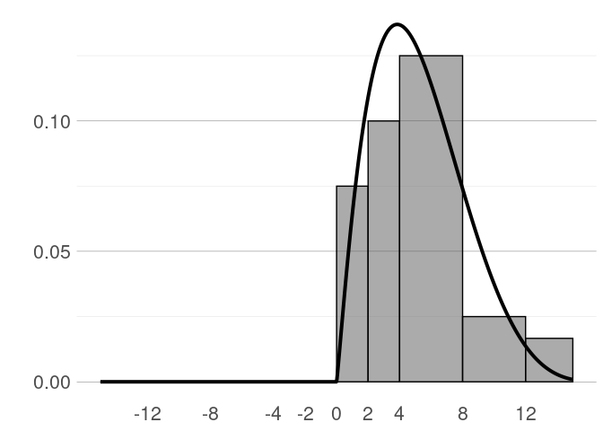

forecasthistogram
================

## About

This is an in-progress R package that contains functions to handle and
study subjective probabilities (‘forecast histograms’) as collected in
several economic surveys. The package accompanies the paper ‘Quantifying
subjective uncertainty in survey expectations’ by Fabian Krüger and Lora
Pavlova, available at
<https://econpapers.wiwi.kit.edu/downloads/KITe_WP_139.pdf> (updated
version coming soon).

The package is presently available via GitHub only. To install the
package, use the following:

``` r
#library(remotes)
#install_github("FK83/forecasthistogram")
library(forecasthistogram)
# load magrittr package for pipe operator
library(magrittr) 
```

## Example

The following code generates a forecast histogram object, plots it, and
computes several summary measures.

``` r
# Vector of upper bin limits used in the NY Fed's Survey of Consumer Expectations
ub <- c(-12, -8, -4, -2, 0, 2, 4, 8, 12, Inf)
# Example vector of probabilities
p <- c(rep(0, 5), c(.15, .2, .5, .1, .05))
# Make forecast histogram object and quantify it (see ?quantify)
f <- forecasthistogram(p, ub) %>% quantify
# Plot histogram
plot(f)
```

<!-- -->

``` r
# Compute mean and quantiles
mean(f)
```

    ## [1] 5.249223

``` r
quantile(f, probs = c(.1, .25, .5, .75, .9))
```

    ##      10%      25%      50%      75%      90% 
    ## 1.795743 3.048362 4.898946 7.106687 9.219803

``` r
# Compute ERPS measure proposed by Krüger and Pavlova (2022)
erps(f)
```

    ## [1] 0.53

``` r
# Alternatively: Computation based on original probabilities
sum(cumsum(p)*(1-cumsum(p)))
```

    ## [1] 0.53
